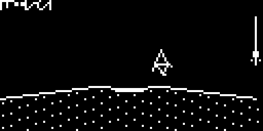

# Moon Lander for Adafruit RP2040 + OLED display

A lunar lander game for the Adafruit Feather RP2040 with a 128×64 OLED FeatherWing (SH1107).

## Screenshot (mockup)

_(TODO: Real screenshot + video)_

## Hardware

| Part | Detail |
|------|--------|
| MCU | [Adafruit Feather RP2040](https://www.adafruit.com/product/4884) |
| Display | [128×64 OLED FeatherWing](https://www.adafruit.com/product/4650) (SH1107) |
| Input | Wing buttons A, B, C |
| Feedback | On-board NeoPixel |

Stack the OLED FeatherWing on the Feather RP2040. Connect over USB with a data cable.

## Software

- **Arduino IDE**
- **Board package:** Raspberry Pi Pico/RP2040 by **Earle Philhower**
- **Board:** Adafruit Feather RP2040

### Libraries

Install via Library Manager:

- Adafruit SH110x
- Adafruit GFX Library
- Adafruit BusIO
- Adafruit NeoPixel

## Upload

1. Open `rp2040_moon_lander.ino` in the Arduino IDE.
2. Select **Adafruit Feather RP2040** and the correct USB port (`/dev/cu.usbmodem*` on macOS).
3. Upload.

If serial upload fails, enter the bootloader (hold **BOOT**, tap **RESET**) and drag a `.uf2` build onto the `RPI-RP2` drive.

## Controls

| Button | Action |
|--------|--------|
| **A** | Rotate left |
| **C** | Rotate right |
| **B** | Thrust (uses fuel) |
| **A / B / C** | Start game or retry (title / result screens) |

Land on the flat pad slowly and upright. Too fast, too tilted, or rough ground = crash.

The HUD shows remaining fuel (`F:`) and a vertical-speed meter on the right (safe landing threshold marked).
